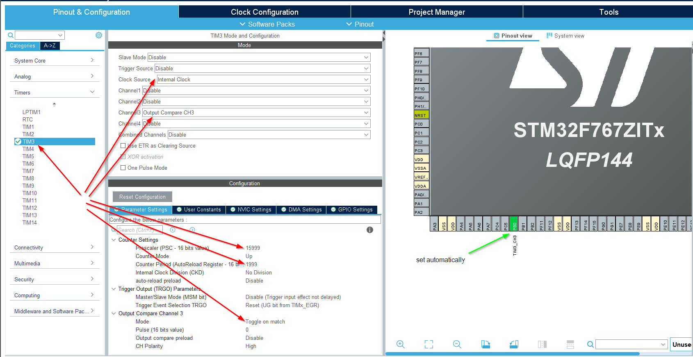

# Timer Output Compare Mode

## What is Timer Output Compare Mode?

Timer Output Compare (OC) mode is a feature that allows the timer to automatically control an output pin based on a comparison between the timer's counter value and a preset value (Compare Value). When these values match, the timer can perform various actions on the output pin such as:
- Toggle the pin state
- Set the pin high
- Set the pin low
- Generate PWM signals

*!!! The key advantage of Output Compare mode is that it handles the pin manipulation in hardware, requiring no CPU intervention, unlike interrupt-based methods.*

## Hardware Setup in CubeMX (.ioc)

### Timer Configuration
1. Navigate to **Timers > TIM3**
2. Configure the following parameters:
   - Clock Source: Internal Clock
   - Channel 1: Output Compare CH3
   - Prescaler (PSC): 15999
   - Counter Period (ARR): 1999

   

#### Code changes in main.c file 
*(+ some changes in stm32f7xx_hal_msp.c file not depicted here)*  
   ```c
    TIM_HandleTypeDef htim3;

    static void MX_GPIO_Init(void);
    static void MX_TIM3_Init(void);

    int main(void)
    {
        MX_GPIO_Init();
        MX_TIM3_Init();
    }

    /**
    * @brief TIM3 Initialization Function
    */
    static void MX_TIM3_Init(void)
    {
        TIM_ClockConfigTypeDef sClockSourceConfig = {0};
        TIM_MasterConfigTypeDef sMasterConfig = {0};
        TIM_OC_InitTypeDef sConfigOC = {0};

        htim3.Instance = TIM3;
        htim3.Init.Prescaler = 15999;
        htim3.Init.CounterMode = TIM_COUNTERMODE_UP;
        htim3.Init.Period = 1999;
        htim3.Init.ClockDivision = TIM_CLOCKDIVISION_DIV1;
        htim3.Init.AutoReloadPreload = TIM_AUTORELOAD_PRELOAD_DISABLE;
        if (HAL_TIM_Base_Init(&htim3) != HAL_OK)
        {
            Error_Handler();
        }
        sClockSourceConfig.ClockSource = TIM_CLOCKSOURCE_INTERNAL;
        if (HAL_TIM_ConfigClockSource(&htim3, &sClockSourceConfig) != HAL_OK)
        {
            Error_Handler();
        }
        if (HAL_TIM_OC_Init(&htim3) != HAL_OK)
        {
            Error_Handler();
        }
        sMasterConfig.MasterOutputTrigger = TIM_TRGO_RESET;
        sMasterConfig.MasterSlaveMode = TIM_MASTERSLAVEMODE_DISABLE;
        if (HAL_TIMEx_MasterConfigSynchronization(&htim3, &sMasterConfig) != HAL_OK)
        {
            Error_Handler();
        }
        sConfigOC.OCMode = TIM_OCMODE_TIMING;
        sConfigOC.Pulse = 0;
        sConfigOC.OCPolarity = TIM_OCPOLARITY_HIGH;
        sConfigOC.OCFastMode = TIM_OCFAST_DISABLE;
        if (HAL_TIM_OC_ConfigChannel(&htim3, &sConfigOC, TIM_CHANNEL_3) != HAL_OK)
        {
            Error_Handler();
        }

        HAL_TIM_MspPostInit(&htim3);
    }

    /**
    * @brief GPIO Initialization Function
    */
    static void MX_GPIO_Init(void)
    {
        /* GPIO Ports Clock Enable */
        __HAL_RCC_GPIOB_CLK_ENABLE();
    }
   ```
   
   *These settings create a 1-second period with 16MHz clock:*
   - *Clock after prescaler = 16MHz/16000 = 1kHz - 1000 ticks per second*
   - *Counter period = 1999 + 1 = 2000 counts - 2000 ticks ~ 2 sec (based on prescaler)*
   - *Final frequency = 1kHz/2000 = 0.5Hz (2-second period)*

### GPIO Configuration
The Output Compare channel is automatically mapped to its corresponding GPIO pin:
- TIM3_CH1 will be automatically configured as:
  - Mode: Timer 3 Channel 1
  - GPIO Mode: Alternate Function
  - GPIO Pull-up/Pull-down: No pull-up and no pull-down
  - Maximum output speed: Low
  - User Label: TIM3_CH1

## Code Implementation

```c
/* USER CODE BEGIN Includes */
#include "main.h"
/* USER CODE END Includes */

int main(void)
{
    /* MCU Configuration--------------------------------------------------------*/
    HAL_Init();
    SystemClock_Config();
    
    /* Initialize all configured peripherals */
    MX_GPIO_Init();
    MX_TIM3_Init();
    
    /* Start timer in Output Compare mode */
    HAL_TIM_OC_Start(&htim3, TIM_CHANNEL_1);
    
    /* Infinite loop */
    while (1)
    {
        /* Empty loop - LED toggling is handled by timer hardware */
    }
}
```

## How It Works

1. **Timer Initialization**
   - The timer is configured with a prescaler to divide the input clock
   - Counter Period (ARR) determines when the timer resets to zero
   - Output Compare mode is set to Toggle (`TIM_OCMODE_TOGGLE`)

2. **Output Compare Operation**
   - Timer continuously counts from 0 to ARR value
   - When the counter reaches the Compare Value (default is ARR/2):
     - Hardware automatically toggles the output pin
     - No CPU intervention required
   - Counter continues until it reaches ARR, then resets to 0

3. **Advantages Over Interrupt Method**
   - Lower CPU overhead (no interrupt handling)
   - More precise timing
   - Less code complexity
   - Better power efficiency

## Timing Calculations

```
Timer Clock = 16MHz (System Clock)
Prescaler = 16000
Counter Frequency = 16MHz / 16000 = 1kHz
Counter Period = 2000 counts
Toggle Frequency = 1kHz / 2000 = 0.5Hz
LED Toggle Period = 2 seconds
```

## Important Notes

1. **Pin Selection**
   - Check the STM32F767 datasheet for the correct TIM3_CH1 pin mapping
   - Ensure the selected pin doesn't conflict with other functions

2. **Clock Configuration**
   - The calculations assume a 16MHz system clock
   - Adjust prescaler and period values if using different clock speeds

3. **Power Considerations**
   - Output Compare mode is more power-efficient than interrupt-based toggling
   - The timer continues to operate even in low-power modes

## Troubleshooting

If the LED isn't toggling:
1. Verify the timer clock is enabled in the RCC configuration
2. Check if the correct pin is connected to the LED
3. Confirm the Timer Channel is properly mapped to the GPIO
4. Verify the prescaler and period calculations

## Additional Capabilities

The Output Compare mode can be modified to:
1. Generate different frequencies by adjusting prescaler and period
2. Create PWM signals by changing the output compare mode
3. Produce complex timing patterns using multiple channels
4. Trigger events at specific times using the compare match event